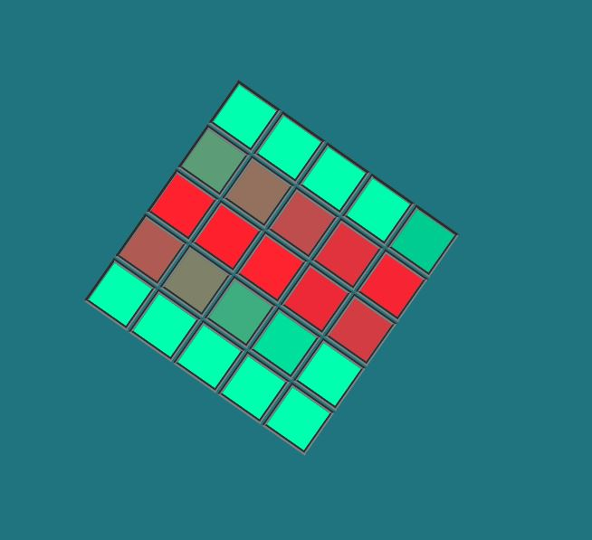

# change-color-sin_animations
START:
 
* Функция принимает два любых rgb на вход.
* Получает разницу между цветами и плавно меняет цвет от первого RGB до второго
* В идеале, обернуть это в класс и добавить альфаканал ещё
 

https://westerovs.github.io/change-color-sin_animations/
